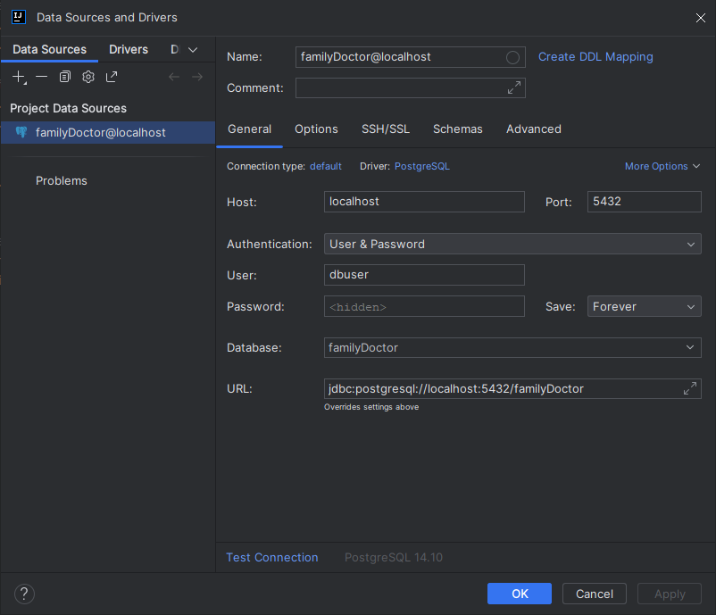

# Distributed-Systems-1st-part-backend

# In order to run the project, you need (local) postgreSQL 14, with a user named "dbuser" and password "pass123". 
# Host is "localhost" and port "5432". 
# Also the database is named as "familyDoctor" but it get created by itself when you run the code for first time.

# If you want, you can add database into the Intellij. For more help you can check the following image:

# If another database with the same name is already in the system you must delete it first, 
# so you don't have any problem using our project and the tables we have. 
# The next time you run our code you don't need to delete the database again. 

# Java 17 needed and maven (3.9 recommended, possibly running in older versions too).

# Now all you have to do is to run the project by pressing the play button in Intellij.