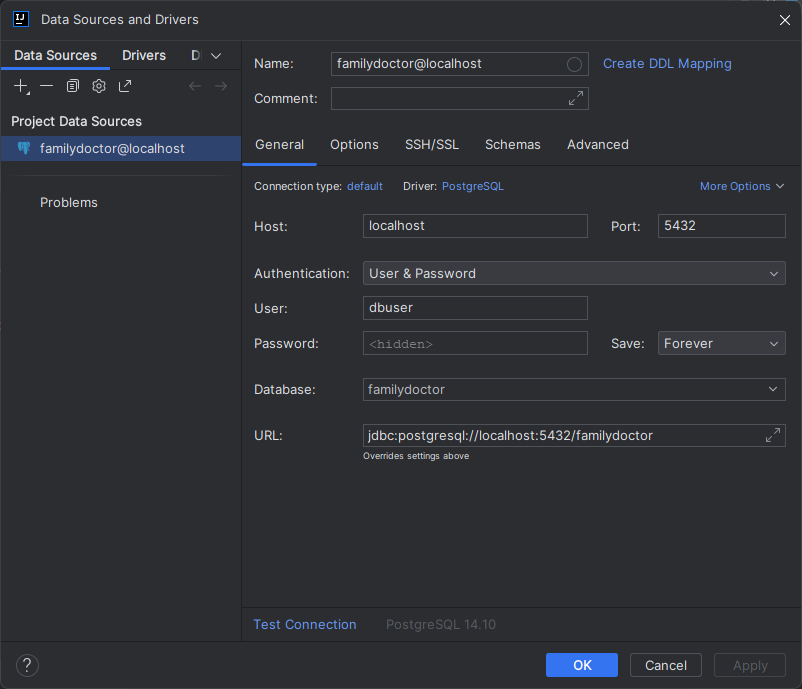

# Family Doctor REST API with Springboot

## Requirements

- **Java** 17
- **Maven** 3.9
- **PostgreSQL** 14

## Database

- **User:** dbuser
- **Password:** pass1234
- **Database:** familydoctor
- **Url:** jdbc:postgresql://localhost:5432/familydoctor

### (Optional) Include database in Intellij:



## Build & Run the App

```sh
./mvnw spring-boot:run "-Dmaven.test.skip"
```

## Clean the build files

```sh
mvn clean
```
